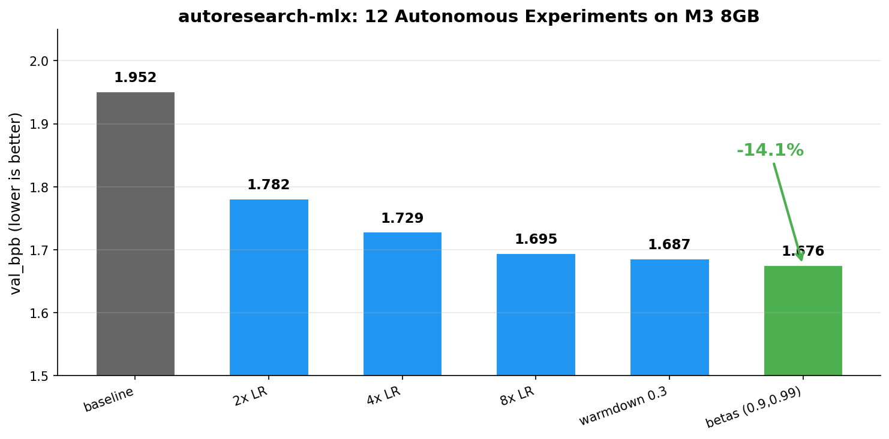

# autoresearch-mlx

[](https://github.com/SingggggYee/autoresearch-mlx/stargazers)
[](https://opensource.org/licenses/MIT)
[](https://www.python.org/downloads/)
[](https://support.apple.com/en-us/116943)

## TL;DR

autoresearch-mlx lets you run karpathy/autoresearch on any Apple Silicon Mac. It is an MLX-native rewrite that works on an 8GB MacBook Air without OOM crashes, with zero NVIDIA GPU dependency. If you want GPT training on Mac with autonomous overnight experiments, this is the Karpathy autoresearch alternative for Mac.

**autoresearch for every Mac**: from 8GB MacBook Air to 192GB Mac Studio.

A native [MLX](https://github.com/ml-explore/mlx) port of Andrej Karpathy's [autoresearch](https://github.com/karpathy/autoresearch). Give an AI agent a small but real LLM training setup and let it experiment autonomously overnight: no NVIDIA GPU required. Built for MLX native LLM training on Apple Silicon machine learning hardware.

## Why this exists

The original autoresearch needs NVIDIA GPUs (CUDA + FlashAttention 3). The popular PyTorch MPS forks crash with OOM on 8GB Macs. This project rewrites the entire stack in MLX, Apple's framework purpose-built for Apple Silicon, so it runs on **any Mac**.

### MLX vs PyTorch MPS

| | PyTorch MPS forks | This (MLX native) |
|---|---|---|
| 8GB Mac | OOM crash | **Works** |
| Install size | ~2 GB (torch) | **~37 MB** (mlx) |
| Device management | `.to("mps")`, synchronize, workarounds | **None needed** |
| Memory model | Separate CPU/GPU pools | **Unified**: all RAM is VRAM |
| Attention | SDPA with manual mask fallback | **Hardware-accelerated causal** |
| Compilation | `torch.compile` disabled on MPS | **`mx.compile` works natively** |



## Benchmark (M3 8GB MacBook Air)

```
val_bpb:          1.676
training_seconds: 300
total_seconds:    310
peak_memory_mb:   1765
num_steps:        ~2100
num_params_M:     3.5
throughput:       ~65,000 tok/s
step_time:        ~125ms
```

After 12 autonomous experiments (LR tuning, optimizer betas, schedule, architecture), val_bpb improved from 1.95 baseline to 1.676 (14% improvement).

## Quick start

**Requirements:** Any Apple Silicon Mac (M1/M2/M3/M4), Python 3.10+, [uv](https://docs.astral.sh/uv/).

```bash
# 1. Install uv (if you don't have it)
curl -LsSf https://astral.sh/uv/install.sh | sh

# 2. Install dependencies
uv sync

# 3. Download data and train tokenizer (one-time, ~2 min)
uv run prepare.py

# 4. Run a single training experiment (~5 min)
uv run train.py
```

That's it. No CUDA, no driver setup, no OOM tuning.

## Running the agent

Spin up Claude Code, Codex, or any coding agent in this repo, then prompt:

```
Have a look at program.md and let's kick off a new experiment! Let's do the setup first.
```

The agent reads `program.md`, establishes a baseline, then iterates autonomously: modifying `train.py`, running 5-minute experiments, keeping improvements, discarding regressions. ~12 experiments/hour, ~100 overnight.

## How it works

Three files:

| File | Role | Who edits |
|------|------|-----------|
| `prepare.py` | Data download, tokenizer, dataloader, evaluation | Nobody (fixed) |
| `train.py` | GPT model, optimizer, training loop | The AI agent |
| `program.md` | Research instructions for the agent | You |

Training runs for a **fixed 5-minute time budget**. The metric is **val_bpb** (validation bits per byte): lower is better.

## Use cases

- Run Karpathy nanochat training on a MacBook Air
- Autonomous AI research overnight on Apple Silicon
- Train small GPT models without CUDA or NVIDIA GPU
- Benchmark MLX vs PyTorch MPS on M1/M2/M3/M4 Macs
- Let Claude Code or Codex iterate on a real LLM training loop
- Reproduce nanochat on Mac Mini, MacBook Pro, or Mac Studio
- Hands-off LLM hyperparameter search with a 5-minute time budget

## Architecture

The model is a simplified single-device GPT, fully implemented in MLX with zero PyTorch dependency:

- Rotary position embeddings (RoPE)
- Sliding window attention (configurable S/L pattern) with hardware-accelerated causal masking
- Value embeddings (ResFormer) with gated mixing
- ReluSquared activation
- Muon optimizer (Newton-Schulz orthogonalization) for weight matrices + AdamW for embeddings

## Scaling guide

Apple Silicon shares RAM between CPU and GPU. The model automatically scales to your hardware: just adjust `DEPTH` and `DEVICE_BATCH_SIZE` in `train.py`:

| Mac | RAM | DEPTH | Params | Expected performance |
|-----|-----|-------|--------|---------------------|
| MacBook Air | 8 GB | 2 | ~3.5M | val_bpb ~1.68, ~65K tok/s |
| MacBook Pro | 16 GB | 4 | ~12M | Better val_bpb, same speed |
| Mac Pro / Max | 32-64 GB | 8 | ~50M | Approaching original H100 results |
| Mac Studio / Ultra | 128-192 GB | 12+ | 100M+ | Beyond original configuration |

## Project structure

```
prepare.py     : constants, data prep + runtime utilities (do not modify)
train.py       : model, optimizer, training loop (agent modifies this)
program.md     : agent instructions
pyproject.toml : dependencies (just mlx + data utils, no torch)
```

## Acknowledgments

- [Andrej Karpathy](https://github.com/karpathy) for the original [autoresearch](https://github.com/karpathy/autoresearch) concept and [nanochat](https://github.com/karpathy/nanochat) codebase
- [Apple MLX team](https://github.com/ml-explore/mlx) for the framework

## FAQ

### Can autoresearch-mlx run on an 8GB MacBook Air?

Yes. autoresearch-mlx was specifically designed and benchmarked on an 8GB M3 MacBook Air. MLX uses Apple Silicon's unified memory, so all your RAM is available as VRAM - no OOM crashes like PyTorch MPS forks.

### What's the difference between autoresearch-mlx and the original autoresearch?

The original [autoresearch](https://github.com/karpathy/autoresearch) requires NVIDIA GPUs with CUDA and FlashAttention 3. autoresearch-mlx replaces the entire stack with [MLX](https://github.com/ml-explore/mlx), Apple's native framework for Apple Silicon, so it runs on any Mac with zero NVIDIA dependencies.

### Does autoresearch-mlx require an NVIDIA GPU?

No. autoresearch-mlx uses Apple's MLX framework and runs entirely on Apple Silicon (M1/M2/M3/M4). No NVIDIA GPU, no CUDA, no driver setup needed.

### How many experiments can autoresearch-mlx run overnight?

Each experiment takes about 5 minutes. That's roughly 12 experiments per hour, or about 100 experiments in an 8-hour overnight session. The AI agent autonomously iterates: modifying hyperparameters, running training, keeping improvements, and discarding regressions.

### What LLM agents work with autoresearch-mlx?

Any coding agent that can read files and run shell commands works: Claude Code, OpenAI Codex, Cursor, or similar tools. Point the agent at `program.md` and it will handle the rest autonomously.

### How do I run karpathy autoresearch on a Mac?

Clone this repo, install [uv](https://docs.astral.sh/uv/), run `uv sync`, then `uv run prepare.py` followed by `uv run train.py`. That is the full setup for running karpathy autoresearch on a Mac. No CUDA toolkit, no driver install, no conda environment. See the Quick start section above.

### Does autoresearch-mlx work without CUDA?

Yes. autoresearch-mlx has zero CUDA and zero NVIDIA dependencies. It runs entirely on Apple's MLX framework and uses the Apple Silicon GPU through unified memory. If your machine can run macOS on M1/M2/M3/M4, it can run autoresearch-mlx.

### What's the minimum Mac for running autoresearch-mlx?

An 8GB M1 MacBook Air is the documented minimum and the default benchmark target. Bigger Macs (16GB, 32GB, 64GB, 192GB Mac Studio) let you scale `DEPTH` and `DEVICE_BATCH_SIZE` for larger models, but the 5-minute training loop works on entry-level Apple Silicon out of the box.

### Can I use Claude Code or Codex with autoresearch-mlx?

Yes. Claude Code and OpenAI Codex are the two primary supported agents. Open this repo in either tool, point it at `program.md`, and the agent will read the instructions, establish a baseline, and iterate on `train.py` autonomously. Any agent with file edit and shell access works the same way.

## License

MIT
